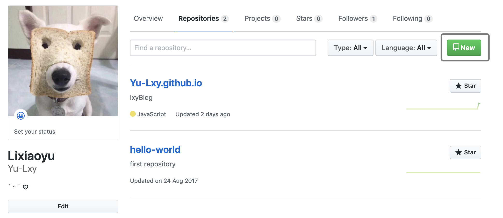
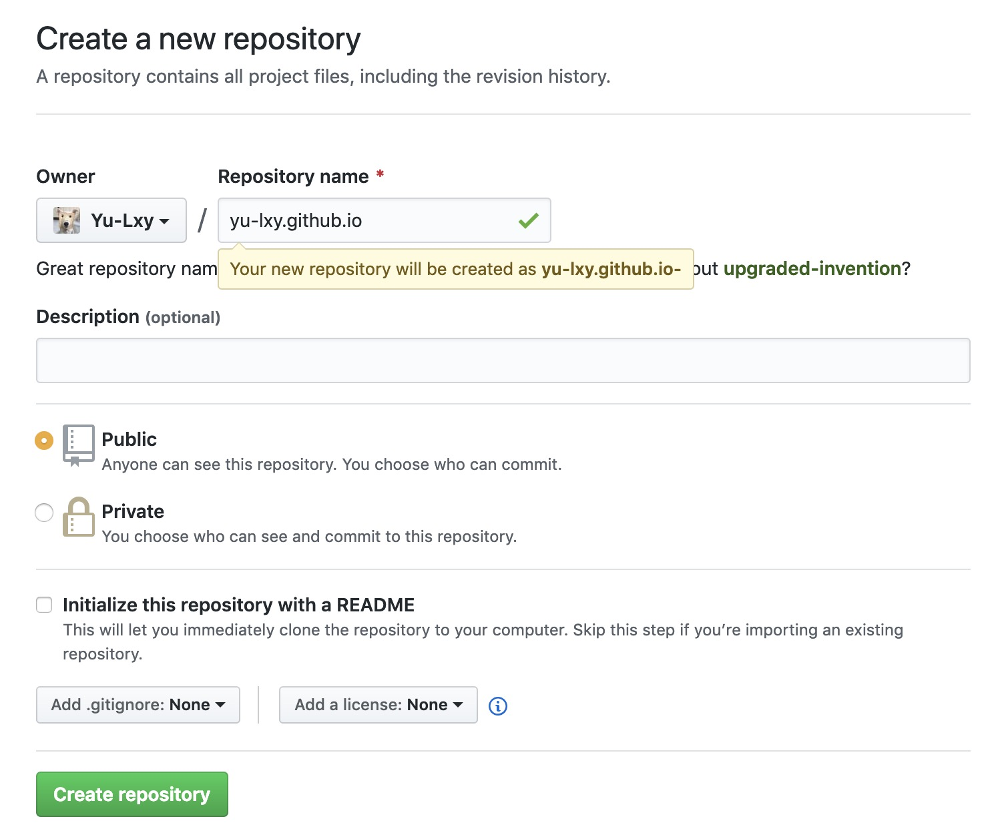
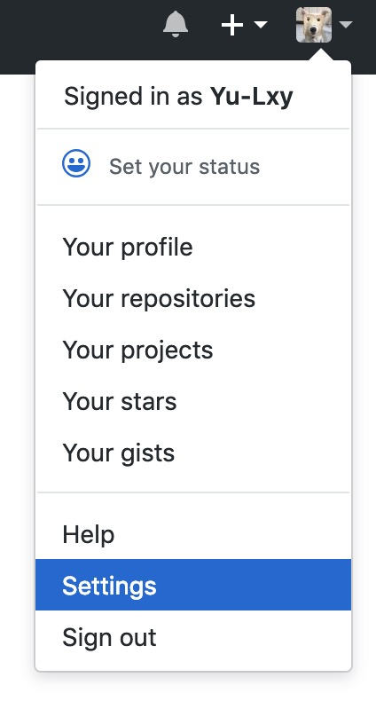
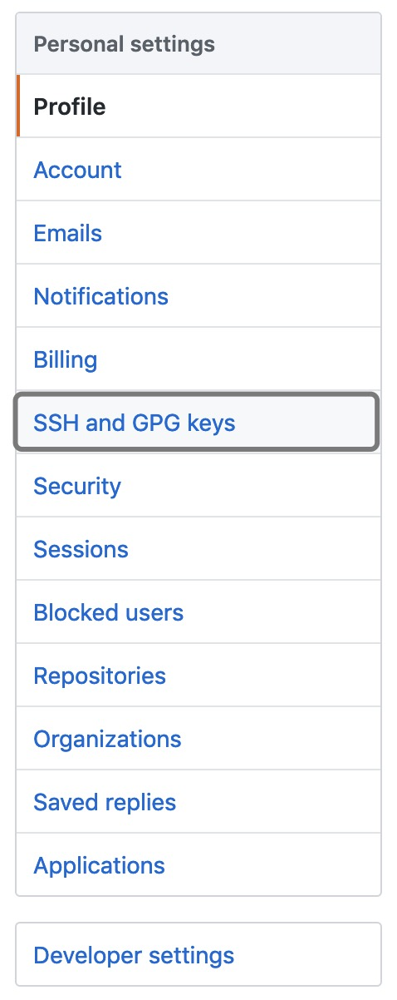
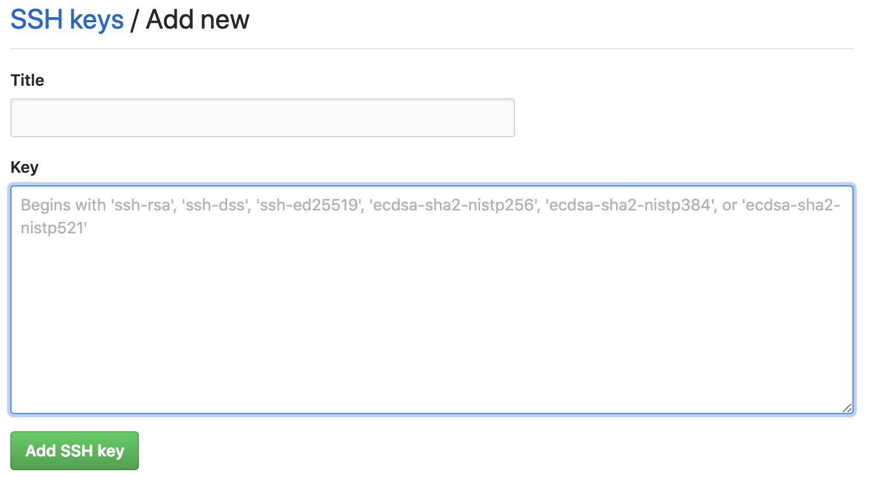

🤩第一次看到这种类型的博客简直不要太好看呀

后来试着搭起来才觉得不只是颜值高

功能也很nice

简单来说hexo就是一个静态页面生成和创建的工具

这篇教你打造一个具有自己风格的hexo博客 ❛˓◞˂̵✧

<!-- more -->

### 我的搭建步骤有以下：
* 安装Git
* 安装Node.js
* 安装Hexo
* GitHub创建个人仓库
* 生成SSH添加到GitHub
* 将hexo部署到GitHub
* 发布文章
* 配置主题和样式
* 备份重要文件


### 1.安装git和node
git和node是必备条件, 可以戳：
[廖雪峰大神的git教程](https://www.liaoxuefeng.com/wiki/0013739516305929606dd18361248578c67b8067c8c017b000)
[下载node](http://nodejs.cn/download/)


### 2.安装hexo
git和node安好之后，接下来就是安hexo了
1.可以先新建一个文件夹，例🌰:我的是myBlog
进到这个文件夹内，打开命令行
2.Windows的小伙伴可以直接用 `npm install -g hexo`
mac的小伙伴需要用 `sudo npm install --unsafe-perm --verbose -g hexo`
完成之后可以 `hexo -v` 查看hexo版本
3.接下来初始化hexo `hexo init`
完成之后会在myBlog生成以下文件：

| 名称           | 说明                                                  |
| -------------- | ----------------------------------------------------- |
| node_modules： | 是依赖包                                              |
| public：       | 生成的静态文件，这个目录最终会发布到服务器            |
| scaffolds：    | 命令生成文章等的模板                                  |
| source：       | 编写的markdown文件，_drafts草稿文件，_posts发布的文章 |
| themes：       | 主题                                                  |
| _config.yml：  | 整个博客的配置                                        |
| package.json： | 项目所需模块项目的配置信息                            |

我们正常使用，修改最多的源码是 `_config.yml` 文件，不管是博客的基础配置，还是模板，都是修改这个文件。
`source` 是我们日常写文章要用的目录，是我们日常操作的文件夹。
如果要修改主题模板，就需要操作 `themes`.

4.接下来
`hexo g`
`hexo s`
就可以在本地 `http://localhost:4000` 预览了
`ctrl+c` 或是 `control+c` 关闭本地服务

### GitHub创建个人仓库
没有github账号需要先注册一个哦
有账号就新建一个库：

建一个和你的username一样名字的库，比如我的就是这样：

点击create repository

### 生成SSH添加到GitHub(mac)
1.检查是否已经存在SSH Key
打开电脑终端，输入 `ls -al ~/.ssh`
2.如果终端出现文件id_rsa.pub 或 id_dsa.pub，则表示该电脑已经存在SSH Key，此时可继续输入
`cat ~/.ssh/id_rsa.pub`
复制接下来显示出来的一大串内容
3.如果终端未出现id_rsa.pub 或 id_dsa.pub文件，表示该电脑还没有配置SSH Key，此时需要输
`ssh-keygen -t rsa -C "your_full_name@xxxxx.com"`
连续回车即可，也可能会让你输入密码，密码就是你的开机密码
创建完成后按照第二步操作复制就行啦
这时候去到GitHub的setting
再点击SSH and GPG keys
点击New SSH key之后吧你刚刚复制的一串key粘在这里面 点击Add SSH key就ok啦


### 将hexo部署到GitHub
完成这一步就可以把你的hexo部署到github上辣
1.首先在你的项目文件下找到 `_config.yml` 进去找到
```
deploy:
  type: git
  repo: https://github.com/YourgithubName/YourgithubName.github.io.git
  branch: master
```
把这个地址改成你专属的，比如我的是：
```
repo: https://github.com/Yu-Lxy/Yu-Lxy.github.io
```
*注：这里有个坑🕳，一定要在冒号后面加一个空格，不然 `hexo d` 的时候会没有反应

2.需要安装deploy-git,也就是部署的命令,这样你才能用命令部署到GitHub:
`npm install hexo-deployer-git --save`
3.然后
`hexo g`
`hexo d`
输入 `http://yourname.github.io` 就能看到你的hexo咯~😆


