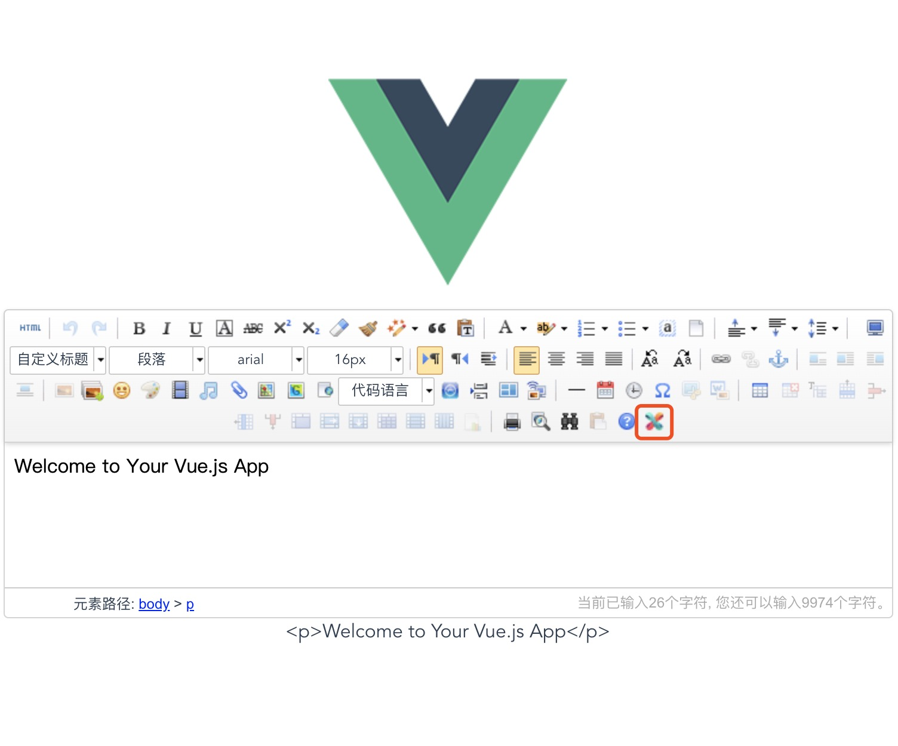

我们的项目中使用的是ueditor+秀米的富文本编辑器，github上的大神做了一个基于vue的ueditor的组件，能够实现双向数据绑定，可以不用费劲的getContent、setContent。就决定用这个组件 ——  [vue-ueditor-wrap](https://github.com/HaoChuan9421/vue-ueditor-wrap)	。so~  vue+vue-ueditor-wrap+秀米. 开始吧 ⤵︎

<!-- more -->

**一：去ueditor官网下载官方源码** 

1. https://ueditor.baidu.com/website/download.html

2. 下载完成后，放到你的Vue项目里static下并命名为UEditor。

**二：安装vue-ueditor-wrap** 

```javascript
npm i vue-ueditor-wrap
```
**三：引入并使用** 
1. main.js
```javascript
// The Vue build version to load with the `import` command
// (runtime-only or standalone) has been set in webpack.base.conf with an alias.
import Vue from 'vue'
import App from './App'
import router from './router'
// 引入ueditor的依赖文件
import '../static/UEditor/ueditor.config'
import '../static/UEditor/ueditor.all.min.js'
import '../static/UEditor/lang/zh-cn/zh-cn.js'
import '../static/UEditor/ueditor.parse.min.js'

Vue.config.productionTip = false

/* eslint-disable no-new */
new Vue({
  el: '#app',
  router,
  components: { App },
  template: '<App/>'
})

```
2. 组件里
```javascript
<template>
  <div class="hello">
  	<!--数据绑定-->
    <vue-ueditor-wrap v-model="msg" />
    <span>{{msg}}</span>
  </div>
</template>

<script>
import VueUeditorWrap from 'vue-ueditor-wrap' // 引入vue-ueditor-wrap
export default {
  name: 'HelloWorld',
  components: {
    VueUeditorWrap	//注册组件
  },
  data () {
    return {
      msg: 'Welcome to Your Vue.js App'
    }
  }
}
</script>

<style scoped>

</style>
```
这些完成后，你就可以看到一个初始化好的`ueditor`了，并且可以很方便的绑定想要的数据 ?
接入**秀米**的童鞋继续向下看?

**四：在ueditor基础上接入秀米**

秀米提供：[秀米图文排版UEditor插件示例](http://hgs.xiumi.us/uedit/)

1. 在你的index.html中引用 `http://xiumi.us/connect/ue/xiumi-ue-dialog-v5.js` 和 `http://xiumi.us/connect/ue/xiumi-ue-v5.css` 也可以下载文件后放在UEditor目录下引入本地文件，这样方便修改。（我是下载后引入本地的）如下
```javascript
<link rel="stylesheet" href="static/UEditor/xiumi-ue-v5.css">
<script type="text/javascript" charset="utf-8" src="static/UEditor/xiumi-ue-dialog-v5.js"></script>
```

2. 下载文件 `http://xiumi.us/connect/ue/xiumi-ue-dialog-v5.html` 和 `http://hgs.xiumi.us/uedit/dialogs/internal.js` 放在你的UEditor目录下。

3. 修改`UEditor`的配置（ueditor.config.js），第414行左右：将section:[] 改为section:['class', 'style']，避免ueditor修改秀米的格式信息，造成排版错误。

4. 在`xiumi-ue-dialog-v5.js`中把`iframeUrl`改为本地秀米H5的路径，如果你都是按照以上步骤进行那么路径将是`/static/UEditor/xiumi-ue-dialog-v5.html`，如果不是的话要按你自己的路径。


到这里就是可以正常使用秀米并且有着双向数据绑定的ueditor啦。
图片上传相关功能需要后台小哥哥的协助。
其余与秀米的对接可以参考[与秀米对接](http://ent.xiumi.us/)
还是有疑问的小盆友可以下载我上传的[demo](https://github.com/Yu-Lxy/vue-ueditor-wrap-xiumi)，希望可以帮助到你😜

这是接好后的样纸：
